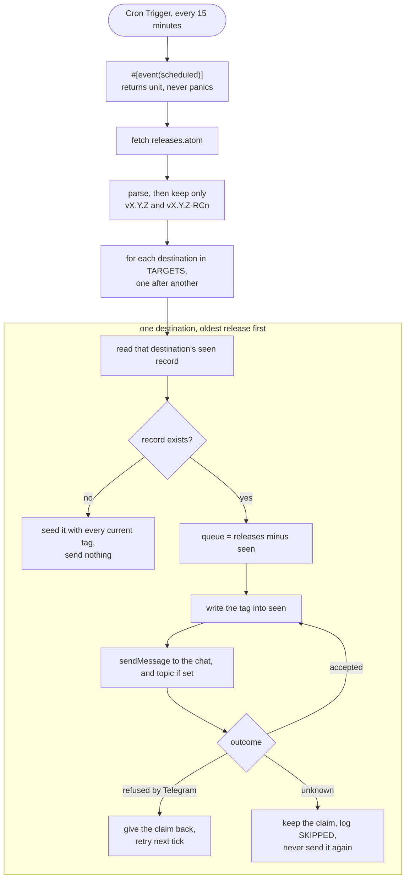

## Goal

A Telegram bot that announces new Kotlin releases. It watches the GitHub releases feed of `JetBrains/kotlin` and posts one message per new stable release or release candidate to every destination in a configured list. A destination is a private chat, a channel, a group, or a forum topic inside a group, and the bot fans the same announcement out to all of them. Dev builds and other pre-release churn are dropped.

It is for a single operator who maintains one bot and a set of destinations they control, and for the readers of those destinations who want to hear about Kotlin releases without following GitHub. It runs on Cloudflare Workers and must fit inside the Free plan indefinitely, so the design leans on the smallest number of invocations, subrequests, and storage writes that still gets a release out within a few minutes of it appearing.

## What it does

Every tick the bot fetches `https://github.com/JetBrains/kotlin/releases.atom`, extracts the entries, keeps those whose tag names a stable release or a release candidate, and then, for each destination independently, sends the entries that destination has not received yet and records what it accepted.

The feed has no push counterpart the bot can subscribe to without write access to the JetBrains repository, so polling is the only way in.

Every candidate source has to be readable without credentials. A source needing one would mean another thing to rotate and another way for the bot to go quiet. That rules out the GitHub REST API, which carries the `prerelease` flag the tag filter has to infer, but allows only sixty unauthenticated requests an hour per address and Workers send from shared addresses.

!control select data-source
= GitHub releases Atom feed — no credentials, and unlike the REST API it is not metered per address, so it cannot be starved by other Workers sharing an egress address; one small document carries the tag, the title and the link
- Maven Central coordinates for `org.jetbrains.kotlin:kotlin-stdlib` — no credentials, authoritative for what a build can actually resolve, and immune to how JetBrains chooses to tag; it has no title, no notes and nothing to link to
- The releases page on kotlinlang.org — no credentials, and it reflects what JetBrains announces to users rather than what it tags; it is HTML written for humans, so a redesign breaks the parser with no error

The feed is one document holding the last ten releases, roughly 50 to 150 KB with release notes inlined.

The filter is by tag name, since the Atom feed does not carry GitHub's `prerelease` flag. Two tag conventions live in this repository. Real releases are tagged `v2.4.10` for a final, `v2.4.20-RC` and `v2.4.20-RC3` for candidates, and `v2.4.20-Beta1` for betas. Everything TeamCity labels is tagged `build-`, as in `build-2.5.0-dev-6883` and `build-2.4.20-377`. The filter is therefore an allow-list, `/^v\d+\.\d+\.\d+(-RC\d*)?$/`, which admits finals and candidates and rejects both betas and every shape of build tag.

The build tags dominate the feed. At the time of writing all ten entries the feed carries are dev builds spanning about seventeen hours, so the normal outcome of a tick is that nothing matches the filter and no destination is even read. Seventeen hours of feed history against a fifteen-minute poll leaves a release visible for dozens of ticks, so the bot has a wide margin against a missed or delayed tick.

!control multi release-kinds
[x] Final releases (`vX.Y.Z`) — the reason the bot exists
[x] Release candidates (`vX.Y.Z-RC`, `-RCn`) — the operator asked for them; they are the last call to test before a final
[ ] Betas (`vX.Y.Z-Betan`) — add if readers want an earlier signal at the cost of two or three extra posts per cycle
[ ] Dev builds (`build-*`) — never; TeamCity pushes several a day, they crowd out everything else in the feed, and they carry no notes

## Destinations

A destination is one `chat_id`, optionally paired with a `message_thread_id` when it is a forum topic. Telegram's `sendMessage` handles all four destination kinds through those two fields, so the bot has one send path and a destination is fully described by a pair of numbers.

!control select target-configuration
= Worker secret set with `wrangler secret put` — the destination ids never enter the repository, which matters because it is public; the value survives redeploys and changes without touching the code
- Static list in `wrangler.toml` vars — the running configuration sits in version control where it can be reviewed and diffed; only workable if the repository is private
- Subscription via bot commands (`/subscribe` in a chat) — lets anyone add the bot to their own group, but needs a Telegram webhook, an HTTP handler, KV writes on every command, and abuse handling
- List in KV edited with `wrangler kv` — changes without a deploy at all, but the configuration then lives somewhere neither the repository nor the secret list records

`TARGETS` is a comma-separated list of `chat_id` or `chat_id:thread_id` values, for example `-1001234567890,-1009876543210:42,123456789`. Each entry is parsed into a destination and gets a stable key from its own text, so adding or removing one destination never disturbs another's delivery record.

It is stored as a secret rather than a var, so `wrangler.toml` names no destination at all. Nothing in the code changes: the Workers runtime hands vars and secrets to the Worker the same way, and workers-rs reads either through `env.var`. Local runs read it from `.dev.vars`, which is not in version control.

!control select fan-out-strategy
= Sequential sends, destination by destination — keeps every destination's ordering identical, keeps peak Telegram rate well under the 30-messages-per-second global limit, and the whole fan-out is a few hundred milliseconds of wall clock the Worker spends waiting, not computing
- `Promise.all` across destinations — finishes faster, but a burst of releases across many chats can trip Telegram's flood limits and the speed buys nothing on a fifteen-minute schedule
- One Worker invocation per destination via queues — real isolation between destinations, but Queues are not on the Workers Free plan

Every destination receives the same message text. There is no per-destination filtering, formatting, or scheduling.

## Shape of the system

One Worker, one scheduled handler, one KV namespace, and an HTTP handler that only describes the bot. The Worker has four pure functions (parse the feed, filter entries, format a message, parse the target list) and one impure orchestration around them (fetch, read KV, send, write KV).

The orchestration reaches the outside world through two small traits, one for the seen record and one for sending a message. The Worker implements them over KV and `fetch`; the tests implement them over an in-memory map and a script of outcomes. That indirection exists for one reason: the claim-before-send ordering is the whole duplicate guarantee, and it has to be assertable in a test.



!control select runtime-language
- TypeScript on the Workers runtime — the shortest toolchain, no WASM to instantiate, and wrangler needs no build command at all; take it back if startup time ever matters more than CPU headroom
- Kotlin/JS — on-theme for a Kotlin bot, but the Gradle toolchain and Kotlin/JS-to-Workers bundling outweigh a program this size
= Rust via workers-rs — a Free-plan cron invocation gets 10 ms of CPU and that is the one hard limit this bot runs against; compiled WASM parses a 150 KB feed in a fraction of it, and the compiler makes the ordering the duplicate guard depends on hard to get wrong

!control select trigger-mechanism
= Cron Trigger polling — the only mechanism that needs no rights on the upstream repository, and Cron Triggers are free
- GitHub release webhook — instant delivery, but requires admin on `JetBrains/kotlin`, which the operator does not have
- Durable Object alarm — lets the bot back off adaptively, but adds a class and a binding for a schedule that never needs to change

!control select poll-interval
= Every 15 minutes — 96 invocations a day, well under the 100,000-request Free-plan ceiling, and a release is announced within a quarter hour of appearing
- Every 5 minutes — three times the invocations for a release cadence measured in weeks; pick it only if quarter-hour latency is complained about
- Hourly — cheapest possible, but an hour of lag on a release announcement reads as stale

A Free-plan cron invocation gets 10 ms of CPU, and every Worker has one second to start. Those are the two limits the language choice trades between: WASM leaves far more room under the CPU cap than a JavaScript parse of the same feed, and spends some of the startup budget instantiating the module. The feed is small and the binary is one crate deep, so both stay comfortable, but the startup side is the one to watch if dependencies pile up.

The Free plan allows 50 subrequests per invocation. A normal tick makes one, the feed fetch. A tick with new releases makes one plus the number of sends, which is entries times destinations in the worst case. Two new entries across ten destinations is 21 subrequests. The design assumes the operator stays under roughly a dozen destinations; past that a tick during a release burst would need to spill the remainder to the next tick.

## State

The bot needs to remember what each destination has already received. Everything else is stateless.

!control select state-store
= Workers KV — one small JSON array per destination; the Free plan gives 100,000 reads and 1,000 writes a day, and a dozen destinations polled every fifteen minutes is about 1,200 reads a day and a handful of writes a month
- D1 — a real table is nicer to query by hand and would make per-destination history trivial, but a SQL schema and migrations for a few arrays of strings is ceremony
- Durable Object storage — strongly consistent and serialized, which would also close the window where two overlapping invocations both read a stale record; the fifteen-minute spacing against a sub-second tick barely opens it
- No state, compare `updated` against the last tick — zero storage, but a missed or delayed tick silently drops a release

!control select delivery-tracking
= One `seen` key per destination — a destination that starts failing, because the bot was kicked or a topic was deleted, stops receiving and nothing else changes; the others keep their own records and never re-send
- One shared `seen` key written after every destination succeeds — one key instead of a dozen, but a single permanently broken destination blocks the write forever and re-sends every release to every healthy chat on every tick
- One key per destination per release — the finest grain and the easiest to inspect, but it turns a bounded set of small values into unbounded key growth

Each key holds a JSON array of announced tag names, capped at the last 50. The feed only ever shows the last ten releases, so anything older cannot reappear.

On a destination's first tick its key is absent. The bot seeds it with every matching entry currently in the feed and sends nothing to it, so neither a fresh deployment nor a newly added chat replays ten old releases. Existing destinations are untouched by a new one being added.

## Feed parsing

The parser choice is a Rust one now. `fast-xml-parser` is a JavaScript library and cannot be called from a WASM Worker, so the equivalent decision is between crates.

!control select feed-parser
= quick-xml — a real XML parser, so entity decoding, attribute order, self-closing tags and a feed carrying a single entry are its problem rather than the bot's; it is a pull parser that pulls in nothing else, which keeps the WASM module small enough to instantiate well inside the startup budget
- roxmltree — parses the whole document into a borrowed tree, which reads more plainly for pulling three fields out of each entry, at the cost of holding the parsed feed in memory at once
- Hand-rolled scanning over `<entry>` blocks — no dependency and the smallest binary, but entity decoding and a single-entry feed become the bot's problem; take it back only if the crate ever has to go

From each entry the bot takes the tag (the last path segment of the alternate link, `https://github.com/JetBrains/kotlin/releases/tag/v2.4.20-RC3`), the title, and the link itself. The title is GitHub's release name, `Kotlin 2.4.20-RC3`, which reads better than the tag and is what the message shows. The parser decodes XML entities, and the text is re-escaped for Telegram on the way out. The `<content>` block is release notes as escaped HTML; it is not used.

Two parsing details carry weight. Text is taken as text, so a title that happens to look numeric is never coerced to a number. Entries are collected into a vector however many there are, so a feed holding a single release yields one release rather than none.

The feed is fetched once per tick and the parsed result is reused for every destination.

## Messages

!control select message-format
= Telegram HTML parse mode — escaping is three characters (`<`, `>`, `&`) and the message is a title plus a link
- MarkdownV2 — must escape eighteen characters, and a version string like `2.2.0-RC2` contains several of them
- Plain text — nothing to escape, but no bold and the link cannot be attached to the title

!control multi message-contents
[x] Kind label (`Kotlin release` or `Kotlin release candidate`) — lets a reader triage from the notification banner
[x] Version title from the feed — the one fact the message exists to carry
[x] Link to the GitHub release page — where the notes and assets live
[ ] Release notes excerpt — the feed carries them as HTML, but Kotlin notes run to hundreds of lines and Telegram caps a message at 4,096 characters; the link covers it
[ ] Compatibility or upgrade hints — the bot does not know anything the release page does not

Link previews stay enabled. Telegram renders GitHub's release preview card, which supplies the summary the message deliberately omits.

A message is formatted once per entry and the same text goes to every destination.

## Not sending twice

The messages are read by a large audience, so a duplicate is the worst thing the bot can do. Telegram's `sendMessage` has no idempotency key, so the bot cannot ask for a send to be applied once. That leaves a choice about which way to fail, and the design takes at-most-once.

!control select duplicate-guard
= Record the release before sending it, and never retry a send whose outcome is unknown — the only arrangement that cannot post the same release twice, paid for with a release that can go missing and is logged loudly when it does
- Send first, record afterwards — never loses a release, but a lost acknowledgement, an eviction between the two steps, or a retried tick re-posts it to every reader
- Durable Object holding the claim — the same guarantee plus serialized execution, so two overlapping invocations could not both claim the same release; costs a class, a binding and a migration to close a window that a fifteen-minute schedule against a sub-second tick barely opens

Three windows could produce a duplicate, and the design closes all three.

A tick that fails is retried by the Workers runtime, which would replay every send it had already made. The JavaScript runtime offers `controller.noRetry()` to opt out of that; workers-rs exposes no such lever, so the bot cannot ask for it.

It does not need to. The claim is written before the send, so a replayed tick reads a record that already contains every tag the failed run claimed, finds nothing fresh, and sends nothing. The ordering that protects against a crash protects against a retry by the same mechanism.

The workers-rs scheduled handler returns unit, so there is no error for it to propagate in the first place: every failure inside a tick becomes a log line and the handler returns normally. Nothing on the tick path may panic, because an abort is the one failure the bot cannot turn into a log line.

A crash, an eviction, or a CPU limit between a successful send and the write recording it would leave the release looking unsent. The write happens first, so the ordering is claim, then send.

A send whose outcome is genuinely unknown is the hard case, and it decides the whole design. The bot distinguishes two kinds of failure. Telegram's own error envelope, a body parsing as `{"ok": false, ...}`, proves the message was never posted, so the claim is given back and the next tick retries. Anything else, a dropped connection, a timeout, a gateway error page, means the send may have landed with only the acknowledgement lost. The claim stands and the release is never sent to that destination again.

!control select target-failure-handling
= Skip the rest of that destination's queue for this tick — the other destinations are unaffected, and a transient problem clears itself within fifteen minutes
- Retry every failure inside the tick with backoff — would also recover from a blip a quarter hour sooner, but an ambiguous outcome must never be retried, so this would trade the duplicate guarantee for latency
- Drop a destination automatically after a 403 — stops a dead chat being polled forever, but the bot cannot write to `wrangler.toml`, so the removal would live in state the operator cannot see

A rate limit is the exception, because it is not a failure. Telegram slow mode is a standing setting in some groups: the Kotlin Community forum holds it at ten seconds, so two releases in one tick are guaranteed to trip it. Treating that as a failed destination would deliver one release per tick and stretch a pair of announcements across half an hour.

!control select rate-limit-handling
= Wait out `retry_after` and send again, for hints up to a minute — a 429 carries Telegram's envelope and so proves non-delivery, which makes sending again safe; a cron tick may use fifteen minutes of wall clock and waiting spends none of the 10 ms CPU budget
- Treat a rate limit like any other refusal — no waiting code at all, but a group with permanent slow mode then receives at most one release per fifteen minutes
- Space every send by a fixed delay — never trips the limit in the first place, but pays the delay on every tick for a limit most destinations do not have
- Wait however long Telegram asks — handles an hour-long slow mode too, but a tick would sit idle long enough to collide with the next one

The wait is bounded at sixty seconds per release. A longer hint leaves the claim released and the release for the next tick, which is the ordinary refusal path.

A skipped release is logged with the destination and the tag and the word `SKIPPED`, which is the operator's signal that a message needs sending by hand. Recovering one is an edit to that destination's record:

```shell
wrangler kv key get --binding SEEN "seen:-1001234567890"
wrangler kv key put --binding SEEN "seen:-1001234567890" '["v2.4.10"]'
```

## Building, testing, and deploying

The project is a single `src/lib.rs`, a `Cargo.toml` naming `worker`, `quick-xml` and `serde_json`, a `wrangler.toml`, a `package.json` whose only dependency is wrangler itself, and a `tests/` directory holding the feed fixtures and the tests that run against them.

`worker` is declared only for `cfg(target_arch = "wasm32")`, and the glue that uses it sits behind the same gate. That is what lets `cargo test` build the crate for the host, where the `worker` crate could not compile.

Two package managers is not an oversight. Cargo owns the crate and everything the Worker actually runs; wrangler is a Node program and owns deployment, so a small Node manifest sits beside `Cargo.toml` purely to pin it.

!control select package-manager
- npm — ships with Node, so a fresh machine needs no bootstrap before wrangler; take it back if pnpm's strictness ever fights the toolchain
= pnpm — the Node side is one pinned tool, and a content-addressed store makes reinstalling it across machines and CI the cheapest option there is
- Bun — the fastest install, but wrangler drives `worker-build` and `cargo` through Node either way, so it speeds up the part of this build that was never slow
- Yarn — Plug'n'Play resolution catches a phantom dependency before it reaches production; far more configuration than a one-dependency manifest repays

The version is pinned in the `packageManager` field of `package.json` so corepack provisions the same pnpm on every machine and in CI. Scripts run as `pnpm run deploy`, spelled with `run` because `pnpm deploy` is one of pnpm's own commands and would not reach the script. Tests run as `cargo test` and never touch pnpm.

pnpm refuses to run a dependency's install scripts until they are named, and wrangler needs two of them: `workerd` and `esbuild` fetch their binaries that way, and wrangler cannot start without them. Both are allowed in `pnpm-workspace.yaml`, which is the file that makes a fresh clone work. The `wrangler` commands written below go through `pnpm exec` when it is not on the PATH.

The build is `worker-build`, named as the `[build]` command in `wrangler.toml` and invoked by wrangler on deploy. It compiles the crate to `wasm32-unknown-unknown` and emits the shim the Workers runtime loads, so the operator never calls it directly. The Rust toolchain and that target are the one prerequisite a fresh machine needs beyond Node.

!control select test-approach
= `cargo test` against native targets, with the store and the sender behind traits — compiles and runs in seconds without WASM or a Workers emulator, and reaches the parse, the filter, the fan-out and every duplicate window, including the ordering of the claim against the send
- `wasm-bindgen-test` in a headless runtime — runs the same WebAssembly that gets deployed, which a native test cannot vouch for; needs a browser or Node harness and is slower on every run
- No tests, verify by deploying — the feed parsing, the tag filter, and the `TARGETS` parser are the three places a silent bug would post nothing for months

The `TARGETS` parser is covered by tests, including a bare chat id, a chat id with a thread id, and a negative channel id, because a mis-parsed destination is the failure mode that sends messages nowhere or into the wrong topic.

The tests are plain `#[test]` functions; `pollster` blocks on the one future each needs, which is enough because the fake store and fake sender never actually yield. That keeps an async runtime out of the dependency list.

The duplicate guarantees are tested directly, since they are the reason the code is shaped the way it is. One test asserts the exact sequence of writes and sends for a destination, so a future edit that moves the record after the send fails. Others assert that an unknown outcome is never retried, that an outcome Telegram provably refused is retried, and that the tick opts out of the runtime's own retry.

Local verification of the whole loop uses `wrangler dev --test-scheduled` and a request to `/__scheduled`, with `TARGETS` pointed at the operator's own chat. That path builds the real WASM, so it is also the check that the module starts inside the one-second budget.

!control multi deploy-paths
[x] `pnpm run deploy` from the operator's machine — the only step needed, and the operator is the only person deploying
[ ] GitHub Actions on push to `main` — add when a second person needs to ship without Cloudflare credentials, accepting a corepack step in the workflow to get pnpm
[ ] Cloudflare Workers Builds git integration — add if the repository moves to a Cloudflare-connected account and pushes should deploy without any workflow file

`BOT_TOKEN` and `TARGETS` are Worker secrets and never appear in the repository. A first deployment is six commands and one edit:

```shell
rustup target add wasm32-unknown-unknown
pnpm install
wrangler kv namespace create SEEN   # put the printed id in wrangler.toml
wrangler secret put BOT_TOKEN
wrangler secret put TARGETS
wrangler deploy
```

## Decisions

Polling replaces webhooks because the bot has no rights on the upstream repository. Fifteen minutes is the interval that keeps invocations far under the Free-plan ceiling while making the announcement feel timely.

Filtering is by tag shape rather than by GitHub's `prerelease` flag because the Atom feed does not include that flag and the tag convention is stable and documented by usage.

Delivery is tracked per destination rather than once for the whole fan-out. With a single shared record the bot can only mark a release announced when every destination accepted it, so one chat that permanently rejects the bot would hold the record open and re-send every release to every healthy chat on every tick. Per-destination keys make each chat's history its own problem, at the cost of one KV read per destination per tick, which the Free plan absorbs.

The bot is at-most-once rather than at-least-once. With no idempotency key in the Bot API one of the two has to give, and for an audience this size a release that arrives twice is worse than one that arrives late and by hand. Everything else follows from that: the record is written before the send, and an ambiguous outcome is never retried.

The claim ordering does the work that `controller.noRetry()` does in the JavaScript runtime, which workers-rs does not expose. Ordering the write ahead of the send makes a replayed tick a no-op rather than a duplicate, so losing the lever costs nothing. The handler signature returns unit, so failures are logged rather than raised, and that is the reason no code on the tick path may panic.

Only Telegram's error envelope counts as proof of non-delivery. Treating any failure as non-delivery would let a gateway error page re-post a message that had already been read, which is the exact case the design exists to prevent.

Adding a destination seeds it silently instead of backfilling. A new chat wants the next release, not the last ten.

The only retry inside a tick follows a 429. Every other failure waits for the next scheduled tick, and a release stays in the feed for hours, so waiting costs nothing.

Waiting out slow mode is safe precisely because of the rule that governs everything else here: Telegram's error envelope proves the message was not posted. A rate limit is the one refusal that is expected to succeed on a second attempt, so it is the one worth repeating immediately.

Cloudflare assigns a `workers.dev` URL whether or not the Worker wants one, and a Worker with no `fetch` handler answers it with a bare "Worker threw exception" page. The bot answers with a fixed description of itself instead. That is presentation, not an API: the handler takes no input, reads no binding, and has nothing to authenticate.

!control select http-surface
= Fixed status text — turns the URL Cloudflare hands out anyway into something that explains the service, while reading nothing and accepting nothing
- No `fetch` handler at all — the smallest possible surface, but every visit renders a Cloudflare error page that reads like a broken deployment
- Live status read from KV — would show which destinations are current and how far each has got, but the records are keyed by chat id and the URL is public, so it would publish exactly what `target-configuration` moved into a secret
- Redirect to the repository — one line and always accurate, but it tells a visitor nothing about whether this deployment is the one doing the posting

## Invariants

- No destination ever receives the same release twice, under any failure, retry, or restart.
- A release is written to a destination's record before it is sent, never after, and a claim that fails to write stops the send.
- A send whose outcome is unknown is never attempted again; a send Telegram explicitly refused is, including after waiting out a rate limit.
- A release is sent again inside a tick only after a 429, which proves the earlier attempt was not delivered.
- A replayed tick sends nothing that the run it replaces already claimed, because the claim precedes the send.
- The scheduled handler logs every failure and returns normally, and nothing on the tick path panics.
- Every skipped release is logged with its destination and tag, so a missed message is recoverable by hand rather than silent.
- A failing destination never causes a message to be re-sent to a healthy one.
- Adding or removing a destination changes nothing about what any other destination receives.
- A destination added to `TARGETS` receives nothing on its first tick, only releases published after it was added.
- No build tag or beta is ever sent while `release-kinds` excludes them.
- All destinations receive identical message text for a given release.
- The bot token and the destination list exist only as Worker secrets, never in the repository, the logs, or the messages.
- The HTTP handler reads no binding, so no destination can be discovered from the public URL.
- The feed is fetched exactly once per tick regardless of how many destinations are configured.
- Message text sent to Telegram is HTML-escaped before interpolation.
- The parser and the `TARGETS` parser are tested against real inputs, and a change in GitHub's feed shape fails a test rather than silently posting nothing.
- The store and the sender are reachable behind traits, so the claim-before-send ordering is asserted by a test rather than trusted.
- A feed carrying exactly one entry parses as one release, not as none.

## Out of scope

- Any Telegram commands, subscriptions, or replies. The bot only sends.
- Any HTTP endpoint that does something. The one handler returns fixed text and takes no input.
- Per-destination filtering, formatting, or scheduling. All destinations receive the same set of announcements.
- Automatic removal of destinations that reject the bot. The operator edits `TARGETS`.
- Automatic recovery of a release skipped by an unknown send outcome. The log names it, the operator edits the record.
- Guaranteed delivery. The bot deliberately trades a lost release for never sending a duplicate.
- Watching other repositories. The source is a decision in this document, not a runtime configuration.
- Release notes in the message. The link and Telegram's preview card carry them.
- Spilling a large fan-out across ticks. The design assumes a destination count in the low dozens.
- Any data source needing credentials, including the authenticated GitHub REST API. Reading the feed stays unauthenticated.
- Any test that runs the deployed WebAssembly. Native `cargo test` covers the logic; `wrangler dev` is the only check that the real module loads.
- Metrics, dashboards, or alerting. The Worker log in the Cloudflare dashboard is the observability.
