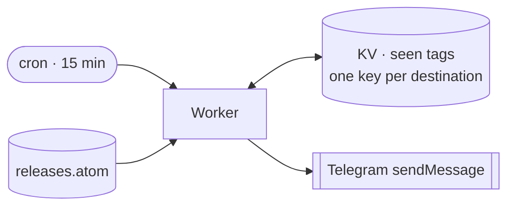

# kotlin-releases-bot

Announces new Kotlin releases to Telegram. Every 15 minutes a Cloudflare Worker
reads the [`JetBrains/kotlin` releases feed](https://github.com/JetBrains/kotlin/releases.atom),
keeps tags matching `vX.Y.Z` and `vX.Y.Z-RCn`, drops betas and `build-*-dev-*`,
and posts each new one to every configured destination — a chat, channel, group
or forum topic.

Each destination is tracked separately, and a release is written to its record
*before* it is sent, so a failure loses a message rather than duplicating one.

## Environment

| Name | Kind | Meaning |
|---|---|---|
| `BOT_TOKEN` | secret | Telegram bot token from BotFather |
| `TARGETS` | secret | Comma-separated `chat_id` or `chat_id:topic_id`, e.g. `-1001234567890,-1009876543210:42` |
| `SEEN` | KV binding | Delivery records, keyed `seen:<destination>` |

Secrets are set with `wrangler secret put`; locally they come from `.dev.vars`.
A destination with no record yet is seeded silently, so adding one never
replays old releases.

Design and rejected alternatives: [BLUEPRINT.md](BLUEPRINT.md).
