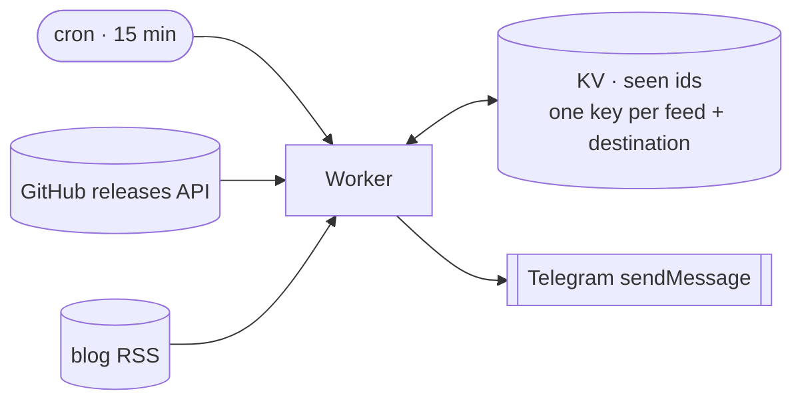

# kotlin-releases-bot

Announces Kotlin releases and blog posts to Telegram. Every 15 minutes a
Cloudflare Worker reads two feeds and posts anything new to that feed's own list
of destinations — a chat, channel, group or forum topic.

- [Releases](https://api.github.com/repos/JetBrains/kotlin/releases): keeps tags
  matching `vX.Y.Z` and `vX.Y.Z-RCn`, drops betas.
- [Blog](https://blog.jetbrains.com/kotlin/feed/): every new post.

Each feed tracks each destination separately, and an item is written to its
record *before* it is sent, so a failure loses a message rather than
duplicating one.

## Environment

| Name | Kind | Meaning |
|---|---|---|
| `BOT_TOKEN` | secret | Telegram bot token from BotFather |
| `TARGETS` | secret | Release destinations: comma-separated `chat_id` or `chat_id:topic_id`, e.g. `-1001234567890,-1009876543210:42` |
| `BLOG_TARGETS` | secret | Blog destinations, same format. Unset means the blog feed is not fetched |
| `SEEN` | KV binding | Delivery records, keyed `seen:release:<destination>` and `seen:blog:<destination>` |

Secrets are set with `wrangler secret put`; locally they come from `.dev.vars`.
A destination with no record yet is seeded silently, so adding one never
replays old releases.

Design and rejected alternatives: [BLUEPRINT.md](BLUEPRINT.md).
